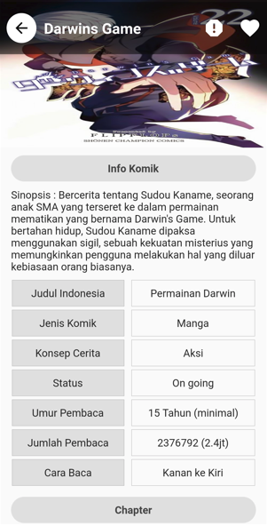

# MangaTime

 

MangaTime is comic reader apps that provides comics in bahasa Indonesia, using firebase for backend.

## Features

- [x] List of Category
- [x] Read chapter vertically or horizontally
- [x] Favorite Comic
- [x] Search Comic by name and Genres
- [x] Report Form

## Screenshots

 
 
 

## Dependencies

- google_fonts: ^2.3.1
- flutter_spinkit: ^5.1.0
- fluttertoast: ^8.0.9
- carousel_slider: ^4.1.1
- provider: ^6.0.2
- dio: ^4.0.6
- shared_preferences: ^2.0.13
- cached_network_image: ^3.2.0
- photo_view: ^0.13.0
